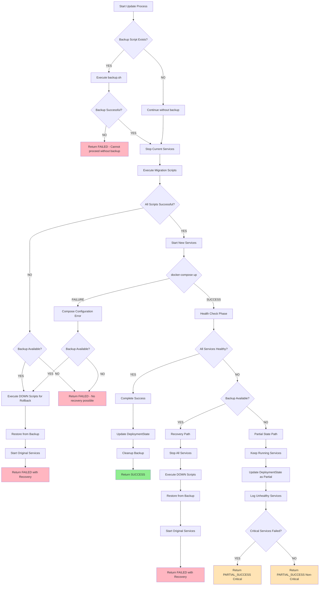

# Docker Partial Failure Decision Tree

## Complete Update Flow with All Failure Points



## Decision Logic Details

### 1. Backup Script Failure
```
IF backup.sh exists AND execution fails THEN
    → Cannot proceed with update
    → No changes made to system
    → Return FAILED immediately
    → System remains in original state
```

### 2. Migration Script Failure
```
IF any migration script fails THEN
    IF backup exists THEN
        → Execute DOWN scripts (reverse order)
        → Restore from backup
        → Start original services
        → Return FAILED with recovery
    ELSE
        → Cannot safely rollback
        → System in inconsistent state
        → Return FAILED without recovery
        → Manual intervention required
```

### 3. Docker Compose Configuration Failure
```
IF docker-compose up fails THEN
    → Configuration/syntax error
    IF backup exists THEN
        → Execute DOWN scripts
        → Restore from backup
        → Start original services
    ELSE
        → Scripts executed but no services running
        → System in limbo state
        → Return FAILED
```

### 4. Health Check Decision
```
IF all services healthy THEN
    → Complete success path
    → Update state fully
    → Clean up backup
ELSE
    → Check backup availability
```

### 5. Backup Availability for Partial Failures
```
IF backup exists THEN
    → Full recovery possible
    → Execute complete rollback
    → Restore to known good state
ELSE
    → Accept partial state
    → Manual intervention required
    → Preserve running services
```

### 6. Service Criticality Assessment
```
IF critical services failed THEN
    → Higher severity response
    → Urgent manual intervention
    → Consider emergency rollback
ELSE
    → Acceptable degraded state
    → Non-critical functionality lost
    → Schedule maintenance window
```

## Implementation Pseudocode

```csharp
public async Task<UpdateResult> ExecuteUpdate(
    DockerComposeConfiguration config,
    DeploymentState currentState)
{
    BackupInfo? backup = null;
    var executedScripts = new List<Version>();
    
    try
    {
        // Phase 1: Backup Creation
        if (await BackupScriptExists())
        {
            // Execute: ./backup.sh --format=json
            // Expected response: { "file": "/path/to/backup/file" }
            backup = await CreateBackup();
            if (!backup.Success)
            {
                return UpdateResult.Failed("Backup creation failed - cannot proceed");
            }
        }
        
        // Phase 2: Stop Current Services
        await StopCurrentServices();
        
        // Phase 3: Migration Scripts
        try
        {
            var scripts = await DiscoverScripts();
            var toExecute = await FilterScripts(scripts, currentState.Version, targetVersion, currentState.Up);
            executedScripts = await ExecuteScripts(toExecute);
            
            // Update state with executed UP scripts
            currentState.Up = currentState.Up.Union(executedScripts);
        }
        catch (Exception ex)
        {
            if (backup != null)
            {
                await RollbackWithBackup(executedScripts, backup);
                return UpdateResult.Failed($"Migration failed: {ex.Message}", recovered: true);
            }
            return UpdateResult.Failed($"Migration failed: {ex.Message}", recovered: false);
        }
        
        // Phase 4: Start New Services
        try
        {
            await StartNewServices();
        }
        catch (Exception ex)
        {
            if (backup != null)
            {
                await RollbackWithBackup(executedScripts, backup);
                return UpdateResult.Failed($"Docker startup failed: {ex.Message}", recovered: true);
            }
            return UpdateResult.Failed($"Docker startup failed: {ex.Message}", recovered: false);
        }
        
        // Phase 5: Health Check
        var health = await CheckServicesHealth();
        if (!health.AllHealthy)
        {
            if (backup != null && health.CriticalFailure)
            {
                await RollbackWithBackup(executedScripts, backup);
                return UpdateResult.Failed("Critical services unhealthy", recovered: true);
            }
            
            // Partial success - keep running services
            await UpdateDeploymentState(currentState, partial: true);
            return UpdateResult.PartialSuccess(health);
        }
        
        // Phase 6: Success
        await UpdateDeploymentState(currentState, partial: false);
        if (backup != null) await CleanupBackup(backup);
        return UpdateResult.Success();
    }
    catch (Exception ex)
    {
        // Unexpected failure - try to recover if possible
        if (backup != null)
        {
            await RollbackWithBackup(executedScripts, backup);
            return UpdateResult.Failed($"Unexpected error: {ex.Message}", recovered: true);
        }
        return UpdateResult.Failed($"Unexpected error: {ex.Message}", recovered: false);
    }
}

private async Task RollbackWithBackup(
    List<Version> executedScripts, 
    BackupInfo backup)
{
    await StopAllServices();
    await ExecuteDownScripts(executedScripts.Reverse());
    
    // Execute: ./restore.sh --file="/path/to/backup" --format=json
    // Expected response: { "success": true } or { "success": false, "error": "reason" }
    var restoreResult = await RestoreFromBackup(backup.FilePath);
    if (!restoreResult.Success)
    {
        throw new Exception($"Restore failed: {restoreResult.Error}");
    }
    
    await StartOriginalServices();
}
```

## Key Decision Points

### 1. **Backup Availability**
- Determines recovery options
- Changes failure handling strategy
- Affects user communication

### 2. **Service Health Status**
- Immediate vs. delayed failure
- Container runtime issues
- Application-level problems

### 3. **Failure Severity**
- Critical vs. non-critical services
- Data integrity risks
- User impact assessment

### 4. **State Consistency**
- Can we maintain consistency?
- Is manual intervention safe?
- What state should we preserve?

## Backup/Restore Script Interface

### Backup Script Contract
```bash
# Command
./backup.sh --format=json

# Success Response
{
    "file": "/backups/backup-20240714-123456.tar.gz"
}

# Failure Response (exit code != 0)
{
    "success": false,
    "error": "Insufficient disk space for backup"
}
```

### Restore Script Contract
```bash
# Command
./restore.sh --file="/backups/backup-20240714-123456.tar.gz" --format=json

# Success Response
{
    "success": true
}

# Failure Response (exit code != 0)
{
    "success": false,
    "error": "Backup file corrupted or missing"
}
```

### BackupService Implementation
```csharp
public class BackupService : IBackupService
{
    public async Task<BackupResult> CreateBackupAsync(string directory)
    {
        var result = await _sshService.ExecuteCommandAsync(
            "./backup.sh --format=json", 
            directory);
        
        if (result.IsSuccess)
        {
            var json = JsonSerializer.Deserialize<BackupResponse>(result.Output);
            return new BackupResult(true, json.File, null);
        }
        
        var error = JsonSerializer.Deserialize<ErrorResponse>(result.Output);
        return new BackupResult(false, null, error?.Error ?? result.Error);
    }
    
    public async Task<RestoreResult> RestoreBackupAsync(string directory, string backupFile)
    {
        var result = await _sshService.ExecuteCommandAsync(
            $"./restore.sh --file=\"{backupFile}\" --format=json", 
            directory);
        
        var json = JsonSerializer.Deserialize<RestoreResponse>(result.Output);
        return new RestoreResult(json.Success, json.Error);
    }
}
```

## Failure Communication

### Success Response
```json
{
    "status": "success",
    "version": "1.2.3",
    "executedScripts": ["up-1.2.1.sh", "up-1.2.2.sh", "up-1.2.3.sh"],
    "healthCheck": "all services healthy"
}
```

### Partial Success Response
```json
{
    "status": "partial_success",
    "version": "1.2.3",
    "healthyServices": ["api", "database"],
    "unhealthyServices": ["cache", "worker"],
    "recommendation": "Manual intervention required",
    "severity": "non-critical"
}
```

### Failed with Recovery Response
```json
{
    "status": "failed",
    "error": "Service health check failed",
    "recovery": "Automatic rollback completed",
    "previousVersion": "1.2.0",
    "backupId": "backup-20240714-123456"
}
```